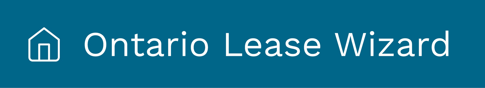

<p align="center">

</p>

## Project Note
- Remember to cd into the `client` folder for all Front-end dev
- PRODUCTION BUILD: https://simply-house.herokuapp.com

## Table of Contents

- [Getting Started](#getting-started)
- [Build Instructions](#build-instructions)
- [TA Instructions](#ta-instructions)
- [Motivation](#motivation)
- [User Interactions](#user-interactions)
  - [Guest](#guest)
  - [Landlord](#landlord)
  - [Tenant](#tenant)
- [Resources](#resources)

## Getting Started

We use `yarn` as the package manager for this project. If you don't have yarn installed already, you can do so by following [this link](https://yarnpkg.com/lang/en/docs/install/). 

Any version of `Node+8` will suffice. If you don't have node installed, [Download](https://nodejs.org/en/download/) from here, or `homebrew` for easier installation on Mac.

To run the application, clone the repo and run the following commands:

```
yarn install
yarn start
```

Navigate to [localhost:3000](http://localhost:3000) to view the running app.

## Development Instructions
In the **root directory**: 

### Front end
```shell script
yarn dev
```
Runs `yarn start`, which starts a Node server on port 3000. 

### Back end
In a new terminal tab/window: 

Using python version `3.6`.

Create a python virtual environment (https://packaging.python.org/guides/installing-using-pip-and-virtual-environments/).

Activate the virtual environment.

```shell script
pip3 install -r requirements.txt
python3 server/app.py
```
This starts the Flask server on port 5000. 

**Important**: Do front end dev work on the 3000 port, while making fetch requests/api calls to the 5000 port. 

Eg.
```javascript
fetch("localhost:5000/test"); 
```

This is because `yarn start` does not make a build folder. 

## Build Instructions

To build a production release, run:

```
yarn build
```

The output of the build process will be located in the `build/` folder.

## TA Instructions

If you want to run the project **locally**, you can simply follow the instructions in the [Getting Started](#getting-started) section above to install dependencies and run the application development server. When you load up the app in your browser, you should see the application Home screen.

We also have a up and running version of the application hosted on Heroku, which can be found [here](https://simply-house.herokuapp.com). This is the most up-to-date version of the application on the `master` branch.

**NOTE**: We are still trying to figure out the perfect configurations and setup with Heroku, which may mean the link may not work as expected every time. If the website did not load initially, simply refresh the page once, and that should load up the website without any problems. 

## Motivation

- In Ontario’s highly regulated residential rental markets, landlords must comply with complex rules that are confusing to landlords and tenants alike. A well-drafted lease is one of the most important tools a landlord has to protect their investment and promote a positive relationship with their tenants.

- Unfortunately, the vast majority of leases are long documents written in legalese that:
  - Leave people confused or misinformed about their legal rights and obligations
  - Contain terms that parties never read, are ambiguous, or may not comply with the law
  - Leave people feeling vulnerable and upset increasing the risk of conflict

## User Interactions

### Guest

**NOTE**: As of the time of writing, the backend is not initialized and deployed. Additionally, some front-end pages have been partially completed, meaning that some features may not be available yet.

As a guest user, you are able to complete the forms but **without** saving any of your progress.

### Landlord

As a landlord user, you have the ability to create multiple leases for multiple tenants, by following the simple-to-use form hosted by the application. Any terms/definitions that may not seem obvious, will be defined in the **Resources** section in the right-hand side. Once the form has been completed, it's sent to the tenant to be viewed.

### Tenant

As a tenant user, you have the ability to view the terms, requiremtns, and any relevant information set out by the landlord in a consise and simple user interface. Analagous to the landlord view, any common terms, policies, or frequently asked questions will be answered in the **Resources** section.

## Resources

- [Figma Link](https://www.figma.com/proto/bNQsYMh1dNhGVlZRSMy8Ly/Standard-Lease-Prototype-for-Development-Team-1?node-id=0%3A1&scaling=min-zoom)
- [CoLab's Proposal](https://lawdesigncolab.ca/portfolio/ontario-standard-lease-form-redesign/)
